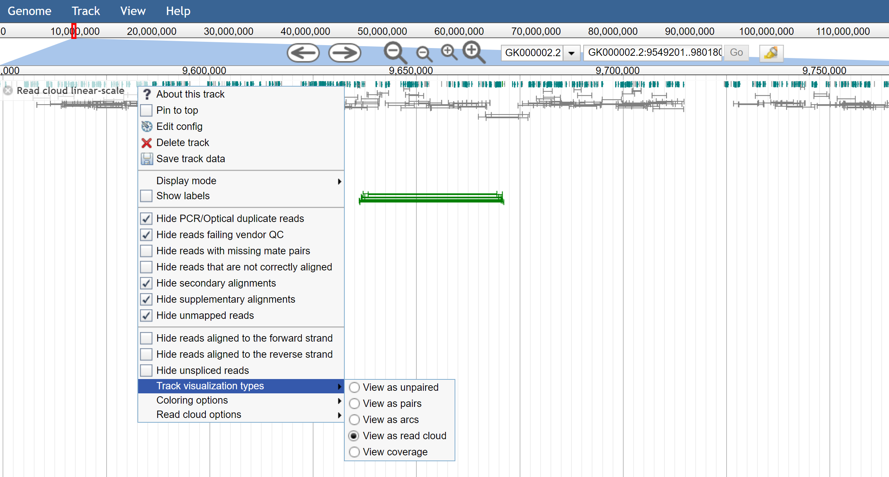

In JBrowse 1.16.0, paired read viewing was introduced to help visualize alignments data. Paired reads are enabled on Alignments2 tracks

## Configuration

The paired read visualizations are enabled on Alignments2 track types. By changing the glyph, you can enable the different paired visualizations on the Alignments2 tracks

|Option|Description|
|------|-----------|
|`PairedArc`|This plots arcs connecting read pairs|
|`PairedReadCloud`|This plots reads according to their insert size on the Y-axis|
|`PairedAlignment`|This enables a pileup view of paired alignments|

Note that the PairedReadCloud and PairedAlignment use a config parameter `maxInsertSize` which only resolves read pairs within a specific insert size. The default `maxInsertSize` is 50,000bp. For larger insert sizes, the `PairedArc` track can be used, which is able to plot larger information. The reason for this is the `PairedArc` view does not need to actually resolve both reads, but can use information from one read to draw towards the other one. The `PairedReadCloud` and `PairedAlignment` both need to resolve the read information before it can be plotted.

Algorithmically, a window of size `maxInsertSize` needs to be fetched surrounding the current view in order to properly resolve the pairs in `PairedReadCloud` and `PairedAlignment` views. For `PairedArc` a window size corresponding to the current viewed window must be fetched in order to make sure that, for example, if a read is paired on either side of a block, that we fetch that data and plot the connection in the in-between block.

## More configuration

|Option|Description|
|------|-----------|
|`colorByOrientation`|Plots pair colors according to their orientation|
|`colorByOrientationAndSize`|Plots pair colors according to their orientation along with insert size|
|`colorBySize`|Plots pair colors according to their insert size|
|`orientationType`|Different sequencing technologies generate pairs of different orientations. Default `fr` for paired end sequencing. Mate pair is `rf`. Solexa is `ff`. See https://software.broadinstitute.org/software/igv/interpreting_pair_orientations|

## For developers

The paired read visualizations have been tested on both BAM and CRAM data types. If you are implementing your own custom store class with paired read data support, you must implement for your feature types:

- a method that can be called as yourfeature.pairedFeature() method that returns true
- data attributes the reads called yourfeature.read1 and yourfeature.read2

Furthermore store class must implement usage of the `InsertSizeCache` for insert size stats estimation, `SpanCache` for the PairedArc visualization, and `PairCache` for the `PairedAlignment` and `PairedReadCloud` visualizations. See the BAM and CRAM store class implementations for these.

## Screenshots

Figure 1. Mate pair libraries showing the pileup view and arc view of the same data. The pileup view has `colorByOrientationAndSize` turned on, and the below has only `colorByOrientation` turned on. The red lines indicate abnormally large insert size.

Figure 2. The read cloud view of the same data, using on top the linear-scale and on the bottom the log-scale. The configuration option is `readCloudLogScale: true` but can be enabled via the track menu also

Figure 3. The track menu shows the ability to toggle different track visualizations by the user easily

